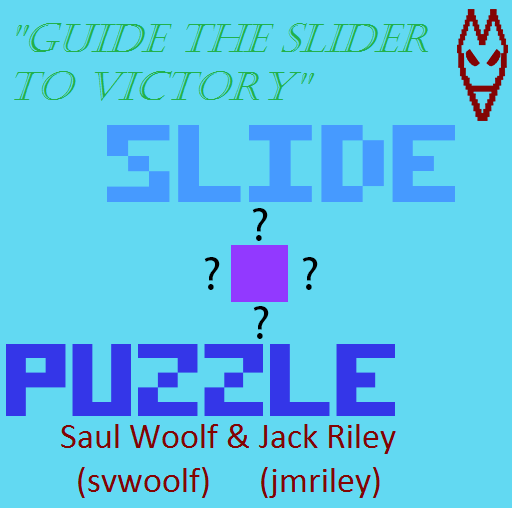

# IMGD_Puzzle

This game was developed for an Interactive Media and Game Development course at Worcester Polytechnic Institute. We were required to use a matrix of pixels (30 by 30 or smaller) to make an abstract game using the Perlenspiel library. I decided to make a game with the following features:
* Level Progression
* 'Ice' Color Pallet
* Realtime Movement
* Time-based score 

Downloading the repository and opening cover.html in chrome (with an internet connection to get the perlenspiel library) will start the game. 
